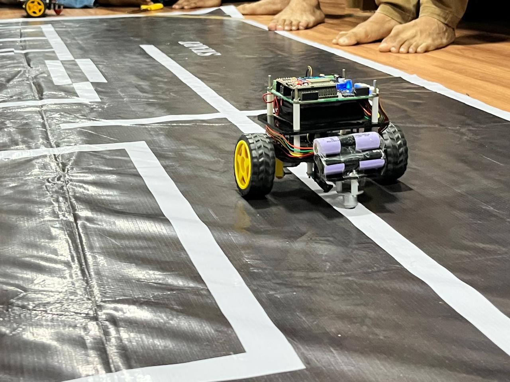

# Maze-Solver-Robot

The **Maze-Solver-Robot** is a project that demonstrates the use of robotics and algorithms to solve mazes. It integrates a robot with a navigation system designed to efficiently find the optimal path through a maze. The project utilizes hardware such as motors and sensors, combined with software for real-time decision-making and movement.

I built this robot for a competition organized by my robotics club, the Society of Robotics and Automation (SRA), called the SRA Autosim Challenge (SAC). The objective was to develop autonomous line-following robots capable of navigating complex mazes while detecting and avoiding obstacles along the way.

The robot employs a left-first maze-solving algorithm for maze solving. It features a custom-built line-sensing array consisting of five pairs of photodiodes and IR LEDs, enabling precise detection of path boundaries. For line following, it utilizes a PID control system, with the proportional (Kp), integral (Ki), and derivative (Kd) gains adjustable in real-time through a WebSocket-based web interface.

---

# Table of Contents

- [Maze-Solver-Robot](#maze-solver-robot)
  - [Features](#features)
  - [Code Overview](#code-overview)
    - [Main Tasks](#main-tasks)
  - [Project Workflow](#project-workflow)

---

## Features
- **Maze Solving Algorithm**: Uses the left-first algorithm to find the shortest path through a maze.
- **Robot Navigation**: Integrates motor control for real-time movement within the maze.
- **Sensor Integration**: Incorporates photodiode and IR LED sensor pairs to detect boundaries for accurate navigation.

---

## Code Overview

This code enables line-following functionality for a robot, utilizing an ESP32, with the following features:

- **IR Sensor**: Detects objects and controls an LED.
- **Line Sensors**: Reads from 5 sensors to follow a black line on a white surface.
- **PID Control**: Implements a PID controller for smooth navigation based on sensor input.
- **Motor Control**: Adjusts motor speeds to follow the line or take turns when needed.
- **Dead-End Handling**: Detects and handles dead-ends by turning the robot.
- **OLED Display**: Displays PID constants if configured.
- **Web Server**: Starts an HTTP server for motor tuning.

### Main Tasks:
- `line_follow_task`: Handles sensor readings, motor control, and error calculation.
- `app_main`: Initializes hardware, configures sensors, and starts the line-following task.

The robot adjusts motor speeds based on sensor readings to keep following the line, with PID constants adjustable through an HTTP server.

---

---

## Project Workflow

- Explored different maze-solving algorithms and decided to use the left-first approach for optimal navigation.
- Configured the code to interface with the line sensing array, consisting of 5 pairs of photodiodes and IR LEDs, to detect the maze path.
- Applied thresholding conditions to the sensor readings to identify intersections (one-sided and plus-shaped) and dead-ends in the maze, and implemented motor control logics to deal with them.
- Implemented a line-following algorithm using PID control to adjust motor speeds for precise path tracking based on sensor input and PID adjustments.
- Set up a WebSocket-based web interface to allow real-time adjustment of PID values (Kp, Ki, Kd) for fine-tuning the robot’s behavior.
- Set up an OLED display to show the current PID constants and relevant debug information.
- Tested and fine-tuned the system to ensure reliable line-following and maze-solving in various scenarios.

